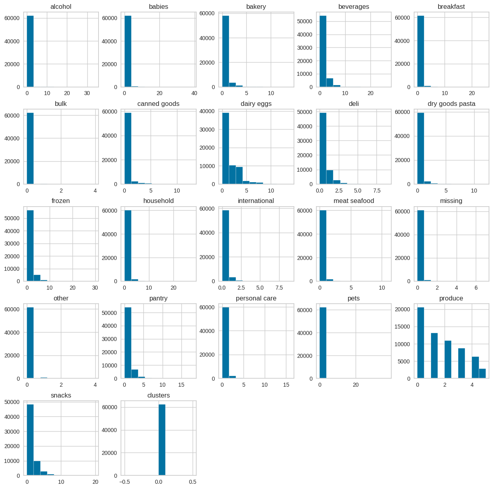
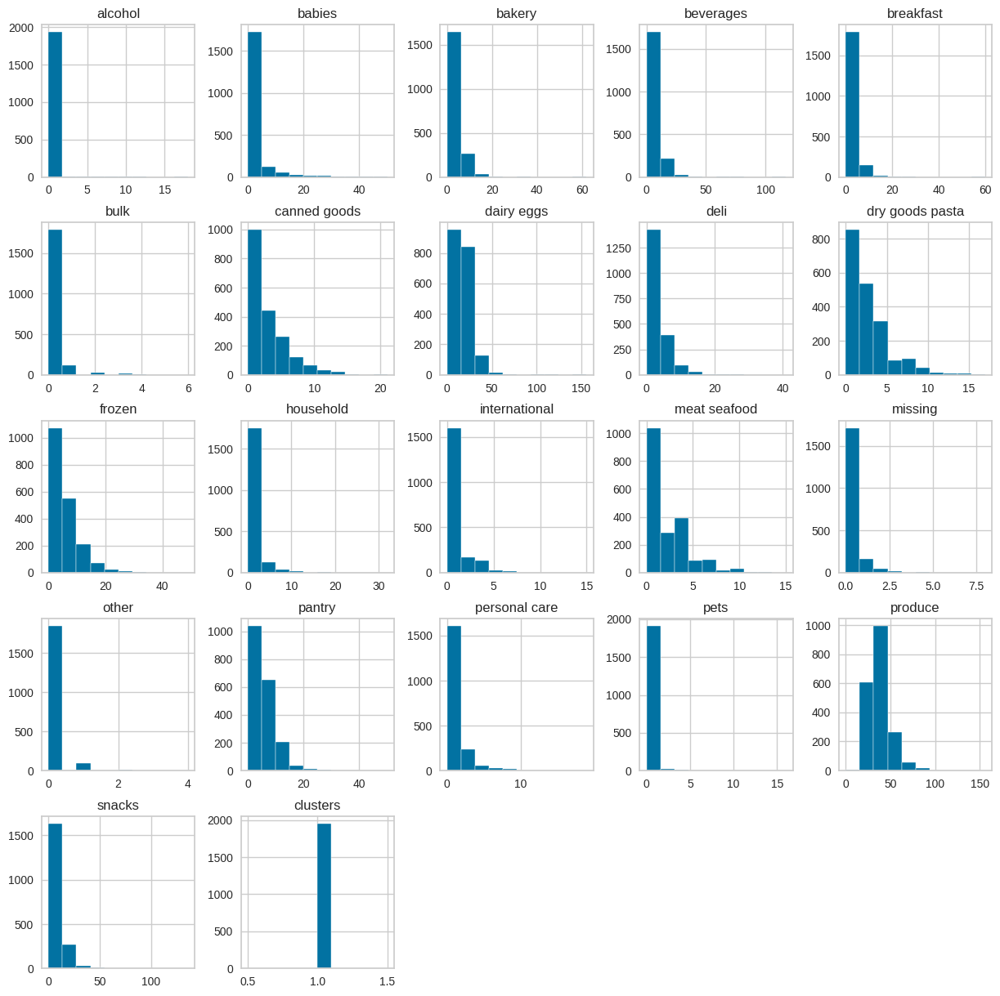
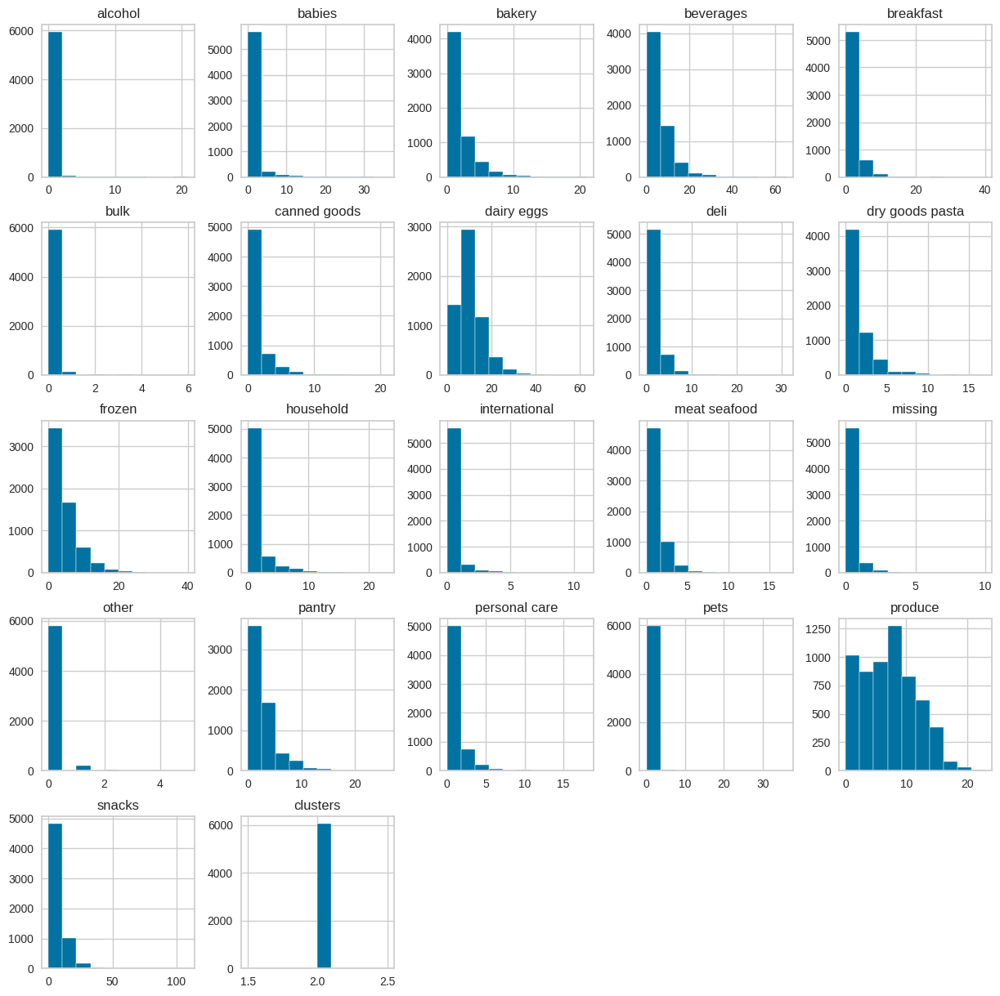
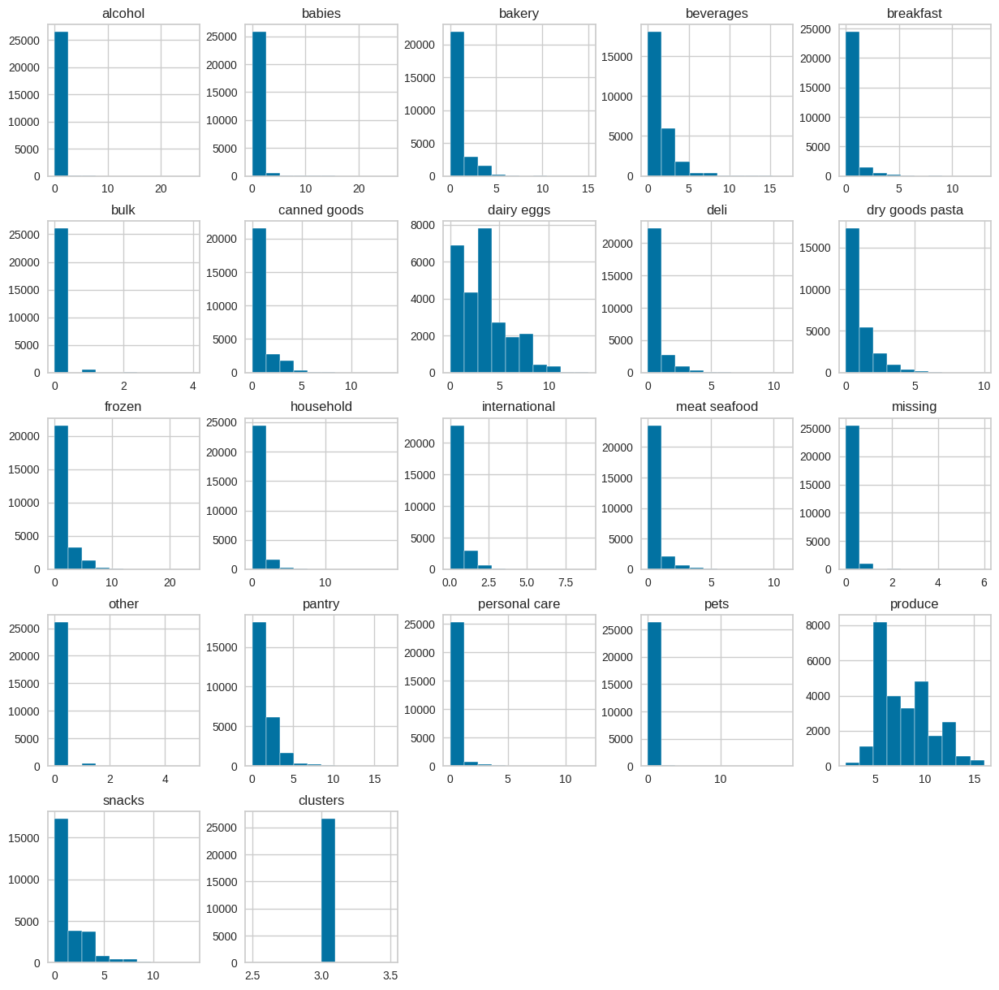
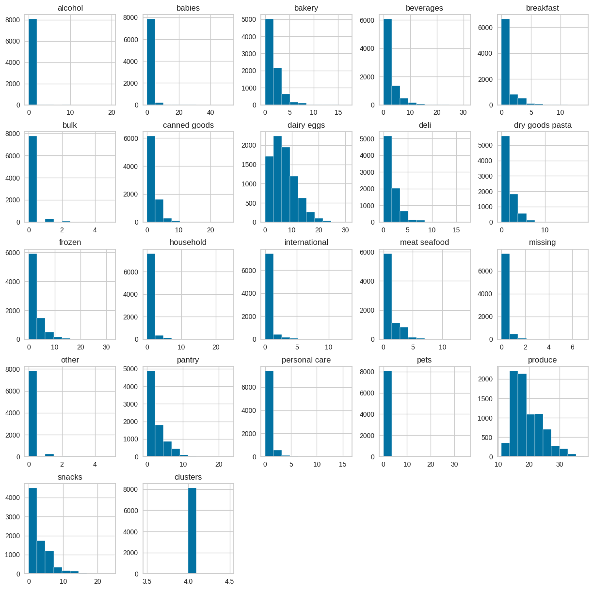

# Predictive Marketing: K-Means clustering & PCA

## ✍ Description:
- In today's business landscape, attracting targeted customers effectively is a key objective. By analyzing consumer behavior, we can gain insights and develop products that resonate with their needs.
- In this project, we aim to create a business value proposition by predicting marketing strategies that target customers based on their purchasing behavior characteristics. This will be achieved using unsupervised machine learning models (K-means) and Principal Component Analysis (PCA) to reduce data dimensionality.
- The dataset contains 2,019,501 rows and 12 columns, detailing the consumer behavior of customers in Hunter's market.

## ✪ Usage:
This project is designed to be completed in the following steps:
1. Download the dataset from Kaggle.
2. Clean the data to prepare it for analysis.
3. Conduct summary statistics to understand the basic features of the dataset.
4. Perform exploratory data analysis (EDA) to identify patterns and relationships.
5. Visualize aggregated data to gain insights.
6. Apply the K-Means model to cluster customers based on their purchasing behavior.
7. Utilize Principal Component Analysis (PCA) to reduce data dimensionality.
8. Summarize and visualize each cluster to develop predictive marketing strategies.

## 🔖 Credits and Acknowledgements:
- Rupesh Kumar: This project was inspired by Rupesh Kumar's work on Kaggle. His project provided valuable insights and served as a reference point in the development of this project. You can view his original work [here](https://www.kaggle.com/code/hunter0007/predictive-marketing-k-means-clustering-pca).

## 🪬 Clustering Visualization:
   
  
  
  
  

  

